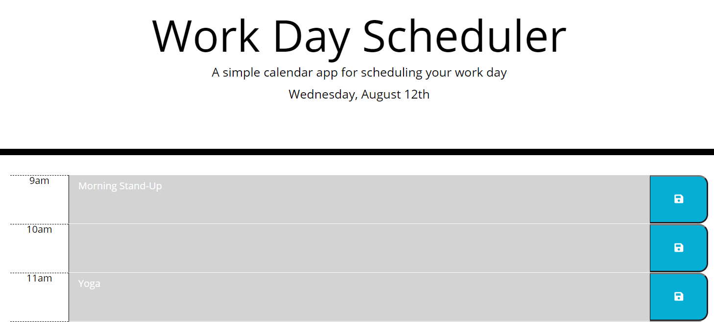
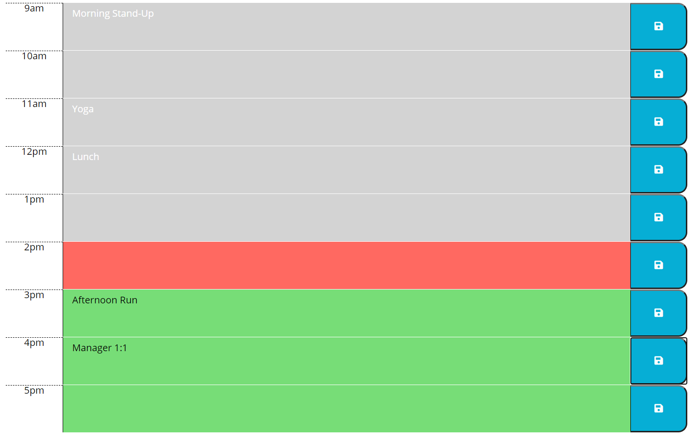
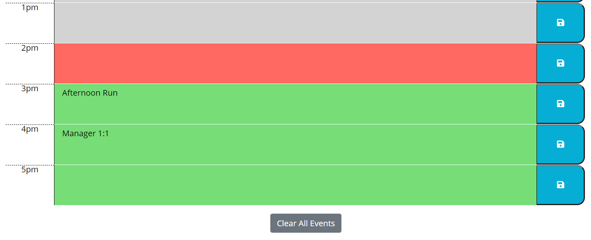

# bootcamp-week5-hw
Work Day Scheduler

Link to app: https://mslee001.github.io/bootcamp-week5-hw/

This website will display the current day and work hour time blocks. The user is able to input text into each time block. When the save button is clicked, the data is saved in local storage and will persist if the user refreshes the page. 

To remove the data, the user can either remove the text and click save, or press the "Clear All Events" button at the bottom of the page to clear all the events for the day. Doing so will clear the data from local storage.

As the day moves on, the time blocks will change color to visually represent past time blocks (gray), the current time block (red), or future time blocks (green).
